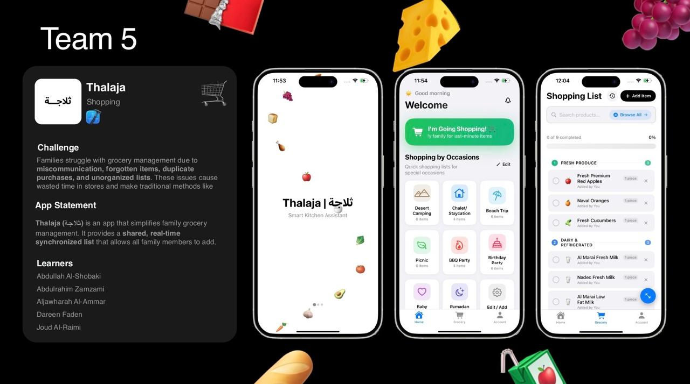

# 🛒 Thalaja | ثلاجة

**Thalaja** is an AI-powered shared grocery list app designed for families.  
Built during the **Apple AI Foundation Program** at **Apple Developer Academy | TUWAIQ**, it helps families reduce waste, save time, and simplify grocery shopping.

---

## 📌 Overview
Managing groceries in families often leads to:
- Duplicated purchases (everyone buys milk 🥛)
- Forgotten essentials (nobody buys rice 🍚)
- Wasted food (expired items in the fridge ❄️)

**Thalaja** solves this by acting as a **shared brain for groceries** — a real-time synced list accessible to every family member.

---

## ✨ Features
- ✅ **Receipt Scan OCR** (Arabic + English) → auto-add items  
- ✅ **Inventory Management** with Pantry/Fridge/Freezer  
- ✅ **Expiry Tracking** → Red dot 🔴 for “expiring soon”  
- ✅ **Smart Grocery Lists** → real-time syncing across family  
- ✅ **AI Coach** → meal suggestions & “use before expiry” tips  
- ✅ **Multi-user sync** → updates visible instantly  
- ✅ **Voice + Siri Integration** → “Hey Siri, add eggs to Thalaja list”  
- ✅ **Barcode Recognition** via OpenFoodFacts API  
- ✅ **Dark Mode & RTL Arabic support**  

---

## 🛠 Tech Stack
- **Frontend:** Swift, SwiftUI (Xcode)  
- **AI/ML:** CoreML, CreateML, Google Gemini API (camera & voice AI)  
- **Cloud & Auth:** CloudKit (real-time sync), Sign in with Apple, Supabase (Gmail login)  
- **APIs:** OpenFoodFacts (barcodes, nutrition data)  
- **Design:** Figma (Apple HIG compliant), Miro for ideation  

---

### Solution – Thalaja App

---

## 👥 Team
Built by Team Thalaja during Apple AI Foundation Program:  
- Abdullah Al-Shobaki  
- Aljawharah  
- Abdulrahim  
- Dareen  
- Joud  

Mentor: **Shahad Alharbi**  
Special thanks to other mentors & ex-mentors at the Academy.  

---

## 🚀 Status
🔒 **This repository contains only documentation, not the full source code.**  
The app is under development as part of Apple Developer Academy projects.  

---

## 📄 License
MIT License – feel free to reuse documentation, but source code is private.
